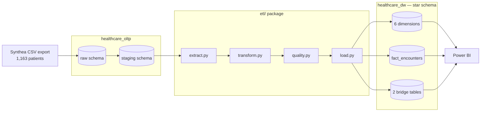
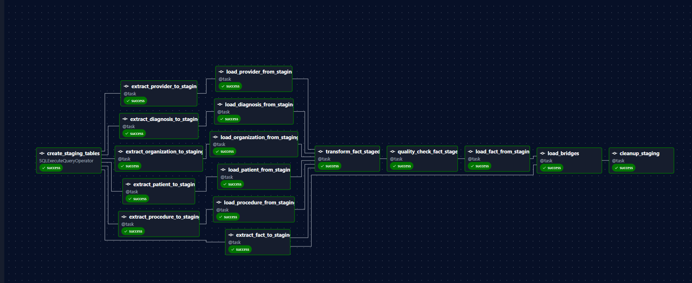
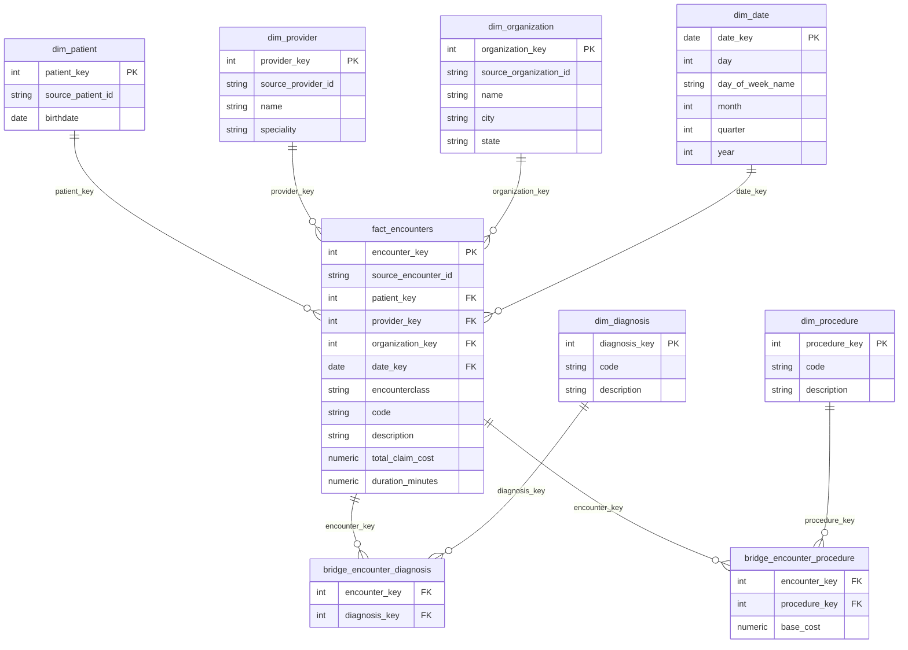
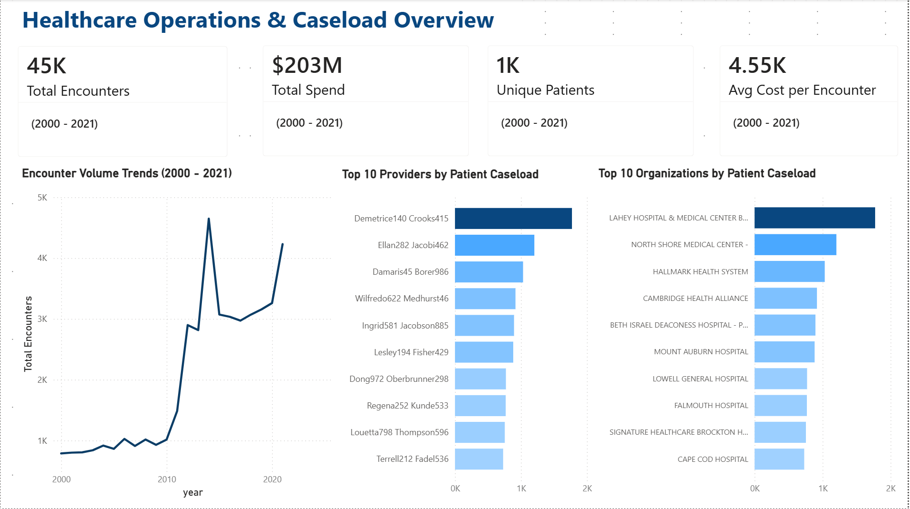
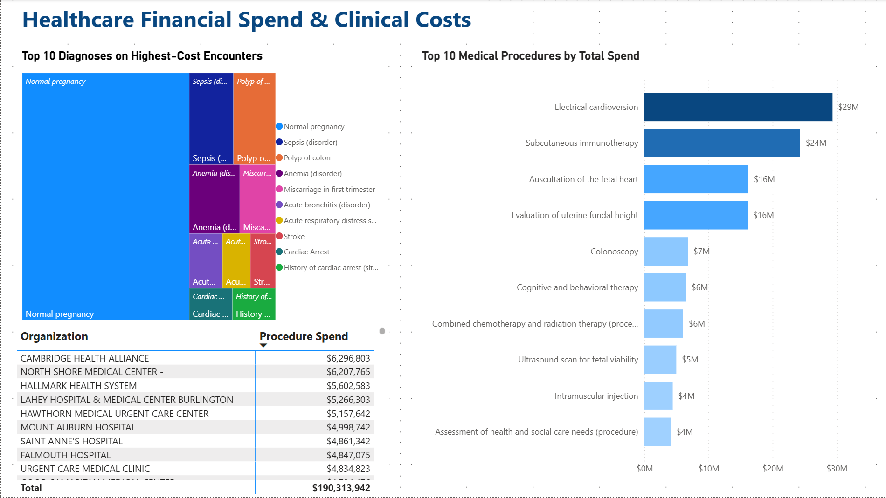

# Healthcare Analytics Data Warehouse


## Overview

Healthcare organizations generate clinical and financial data across multiple disconnected
systems — patient records, encounters, diagnoses, procedures, billing — which makes basic
operational and cost questions hard to answer without manually reconciling data by hand.

This project builds an analytics-ready warehouse from [Synthea](https://synthea.mitre.org/)'s
synthetic EHR data using PostgreSQL, Python, Apache Airflow, and Power BI.

## Business Questions

This warehouse is structured to answer:

- Which diagnoses show up on the highest-cost encounters?
- Which procedures generate the most expense?
- How does patient visit volume change over time?
- Which providers and organizations handle the highest caseload?

## Tech Stack

- **Python** — pandas, psycopg2
- **PostgreSQL** — two databases: `healthcare_oltp` (raw + staging) and `healthcare_dw` (star schema)
- **Apache Airflow** — staged DAG orchestration, watermark-driven incremental loads
- **Power BI** — interactive dashboard answering four business questions
- **SQL** — append-only numbered migrations for schema evolution

The rest of this doc walks through how those pieces fit together, starting with the shape of the
pipeline end to end.

## Architecture



Apache Airflow (`healthcare_dw_pipeline_staged`) orchestrates the ETL package: 5 dimensions load
in parallel, `fact_encounters` runs as 4 staged tasks (extract → transform → quality gate → load)
for per-stage retry and failure visibility, and the two bridge tables load as a single task once
`fact_encounters` is populated (see [Design decisions](#five-decisions-worth-defending) for why).



## Status

| Stage | State |
|---|---|
| OLTP raw + staging schema | Built, loaded |
| `healthcare_oltp` → `healthcare_dw` (star schema) | Built, loaded, verified |
| ETL package (`extract.py` / `transform.py` / `quality.py` / `load.py`) | Complete |
| Airflow orchestration (staged DAG) | Built, verified — full / incremental / idempotent runs |
| Power BI dashboard (2 pages) | Built, verified against source business questions |
| Fault-injection / unit tests | In progress |

## Highlights

- End-to-end ETL pipeline (extract → transform → quality gate → load)
- Incremental, watermark-driven loading
- Idempotent warehouse loads — verified with real re-runs, not assumed
- Star schema dimensional model (6 dims, 1 fact, 2 bridges)
- Bridge tables resolving many-to-many relationships without denormalizing the fact table
- Pre-load data quality gates (row count, null keys, referential integrity, non-negative cost)
- Apache Airflow orchestration — staged, parallelized, per-task retryable
- Power BI dashboard answering all four locked business questions

**1,163 patients · 61,459 source encounters · 40,314 in the 2000–2021 full load · 6 dimensions ·
1 fact · 2 bridges**

## The data model

The warehouse centers on a single fact table, `fact_encounters` — one row per clinical
encounter — with two bridge tables resolving the encounter-to-diagnosis and
encounter-to-procedure many-to-many relationships. An encounter can have zero, one, or several
diagnoses and procedures; the bridges carry exactly that, one row per pairing, rather than
forcing either onto the fact table itself.

Here's why that grain matters in practice — a question a naive join gets wrong: **how much does
each procedure actually cost?**

The obvious approach — join a procedure to its encounter and sum the encounter's total cost —
silently multiplies cost for every encounter that has more than one procedure. An encounter with
3 procedures gets its full cost counted 3 times. That bug made it into this dashboard's first
draft: the top 10 procedures summed to **~$300M** against a **$203M** total warehouse spend.

The fix isn't a smarter join — it's storing cost at the right grain in the first place:

| Procedure | Total Spend |
|---|---|
| Electrical cardioversion | $29M |
| Subcutaneous immunotherapy | $24M |
| Auscultation of the fetal heart | $16M |
| Evaluation of uterine fundal height | $16M |
| Colonoscopy | $7M |

`bridge_encounter_procedure` carries its own `base_cost` column, one row per encounter-procedure
pair. Summing that instead of the encounter-level total makes the query correct by construction —
no fan-out possible, because the grain matches the question being asked.



Why bridges instead of a wider fact table? A fact row with `diagnosis_1..diagnosis_8` columns
(the pattern Synthea's own `claims.csv` uses) hits a ceiling the moment an encounter has more
diagnoses than columns, and leaves most of those columns null for every encounter that has fewer.
Bridges scale to however many diagnoses or procedures an encounter actually has, with no wasted
or truncated space.

## The pipeline

Four modules, one responsibility each:

- **`extract.py`** — reads `healthcare_oltp`. Encounters, conditions, and procedures each have a
  `_full` variant (bounded 2000-01-01 to 2021-01-01) and an `_incremental` variant (watermark-
  driven, everything after the last loaded encounter). Dimension extracts have no time axis and
  always pull in full — `extract_conditions_all` / `extract_procedures_all` specifically pull
  *all* codes ever seen, regardless of date window, so `dim_diagnosis` / `dim_procedure` are never
  missing a code the fact/bridge load is about to need.
- **`transform.py`** — resolves natural keys to surrogate keys via lookup merges, computes
  `duration_minutes` and `date_key`, and drops (with a logged warning) any row whose merge key
  didn't match — `_drop_unmatched` is the single choke point for that behavior across every dim,
  the fact table, and both bridges.
- **`quality.py`** — a gate, not a fixer. Runs row-count, null-key, referential-integrity, and
  non-negative-cost checks *before* load; raises `DataQualityError` on failure instead of
  silently dropping or coercing bad rows. A check that quietly repairs data makes itself
  unfalsifiable.
- **`load.py`** — every insert targets a natural or source key with `ON CONFLICT ... DO NOTHING`,
  so a re-run against already-loaded data is a no-op, not a duplicate.

Orchestrated two ways: a plain `pipeline.py` script for local runs, and an Airflow DAG
(`dags/healthcare_dw_pipeline_staged.py`) for scheduled/production-style runs with per-task
retry and staging tables scoped by batch ID.

## Run it

Requires Postgres (local install or your own container setup) with two empty databases created —
`healthcare_oltp` and `healthcare_dw` — plus Docker for Airflow.

```bash
# 1. deps
python -m venv .venv
.venv/Scripts/activate            # or source .venv/bin/activate on macOS/Linux
pip install -r requirements.txt
cp .env.example .env              # fill in OLTP_DB_* / DW_DB_* credentials

# 2. Create the raw schema
#    Run:
#      sql/oltp/01_raw_schema.sql  → healthcare_oltp

# 3. Import the Synthea source data
#    CSV files are included in:
#      synthea_sample_data_csv_nov2021/csv/
#
#    Import each CSV into its matching table under healthcare_oltp.raw
#    (DBeaver: Right-click table → Import Data → CSV).
#
#    Because the raw schema enforces foreign keys, import the tables in
#    this order:
#
#      organizations
#      providers
#      patients
#      encounters
#      conditions
#      procedures
#      claims
#      claims_transactions

# 4. Create the staging and warehouse schemas
#    Run all numbered migrations in order:
#
#      sql/oltp/migrations/*.sql           → healthcare_oltp (staging)
#      sql/datawarehouse/migrations/*.sql  → healthcare_dw (star schema)

# 5. run the pipeline directly
python pipeline.py --full-reload   # 2000-01-01 through 2021-01-01
python pipeline.py                 # incremental — everything after the watermark

# 6. or run it via Airflow instead
docker compose up -d
# open localhost:8080, trigger healthcare_dw_pipeline_staged with full_reload=true first
```

Then connect DBeaver (or your tool of choice) to `healthcare_dw` to query the warehouse, or point
Power BI at it directly for the dashboard.

## Verified

Measured against the live database today, not assumed:

- **Full load**: every task green end-to-end (Airflow staged DAG), 40,314 fact rows, 22,774
  diagnosis-bridge rows, 68,926 procedure-bridge rows loaded from the 2000–2021 window.
- **Incremental**: watermark-driven load against the held-back post-2021 data added 4,229 fact
  rows, 1,812 diagnosis-bridge rows, 6,677 procedure-bridge rows — first real test of the
  watermark path, not just a unit test.
- **Idempotency, empty case**: re-running incremental with no new data past the watermark
  extracted 0 rows and inserted 0 rows across fact and both bridges.
- **Idempotency, real case**: re-running a full reload *without* resetting the watermark
  re-extracted the entire 2000–2021 window (40,314 fact / 22,774 diagnosis / 69,182 procedure
  rows read) and inserted **zero** new rows anywhere — every row hit `ON CONFLICT DO NOTHING`.
- **Quality gate**: passed on every run (row count, null-key, non-negative-cost checks) with the
  gate's own log line confirming pass/fail per table, not inferred from the absence of an error.
- **Dedup, by design**: `build_bridge_encounter_procedure` groups on `(encounter_key,
  procedure_key)` and sums `base_cost` before load — the 69,182-extracted vs. 68,926-built gap
  in the verification run above is that grouping collapsing duplicate encounter-procedure pairs
  from the source data, not a silent drop.

## Five decisions worth defending

**Cost lives on the bridge, not just the fact table.** `bridge_encounter_procedure.base_cost` is
what makes procedure-level spend queryable without fan-out. `fact_encounters.total_claim_cost`
stays as the correct source for encounter-level totals — the KPI card and the procedure breakdown
intentionally read from two different columns, because they're answering two different questions.

**"Diagnosis spend" is an attribution, not a fact.** There's no cost column on
`bridge_encounter_diagnosis` — diagnoses don't inherently have a cost in this model, only
encounters and procedures do. The dashboard's diagnosis-cost view deliberately attributes each
encounter's full cost to every diagnosis recorded on it (so multi-diagnosis encounters get
counted more than once by design) and is titled "Diagnoses on Highest-Cost Encounters," not
"Diagnosis Spend," so the number can't be mistaken for a causal claim the data doesn't support.

**Postgres generates every surrogate key, not pandas.** `serial4` / `nextval()` on each dimension
table means `transform.py` never has to coordinate auto-increment state across the 5 dimension
branches loading in parallel — the database already serializes that correctly. `load.py` inserts
keyless; a post-load lookup (`extract_lookup_dim`) reads the keys back once the rows exist.

**The incremental watermark is captured before any writes happen, and travels as one XCom.**
An earlier version of this pipeline re-queried the watermark mid-run for the bridge tasks — after
the fact table had already been written to — which meant the watermark had silently advanced past
rows the same run had just loaded, dropping bridge rows for that batch. Capturing it once in
`extract_fact_to_staging`, before any write, and threading that single value through to
`load_bridges` explicitly removed the race condition entirely (see commit `e989bed`).

**The bridge loaders aren't split into staged tasks the way dims and fact are.** Dims (5
independent branches) and fact (its own transform/quality logic) have real, separate failure
surface where per-stage retry pays for itself. The two bridges are similar builds off lookup
tables that are already validated by the time they run — splitting them further would trade
demo-week risk for symmetry, not for a new safety guarantee. All three run modes above passed
cleanly on the current structure; staging them further is the next thing to do with more time,
not a gap in the current one.

## Out of scope

Cut deliberately, not overlooked:

- **`claims_transactions.csv`** — ingested and evaluated during design (its `APPOINTMENTID` join
  to `encounters.Id` verified at 100% overlap), then excluded from the curated model to keep
  complexity proportionate to the timeline. `claims.appointmentid` is the join actually used.
- **CMS DE-SynPUF as a second financial source** — ruled out after confirming CMS's synthetic
  patient population shares no identifiers with Synthea's; a join would have been fabricated, not
  real.
- **`medications.csv`, `observations.csv`, `immunizations.csv`, `allergies.csv`, `careplans.csv`,
  `imaging_studies.csv`, `devices.csv`, `payers.csv`, `payer_transitions.csv`, `supplies.csv`** —
  never in scope; not required by the four target business questions.
- **Cloud deployment, distributed processing (Spark), object storage (S3/MinIO)** — noted as
  future-work directions.
- **PHI/HIPAA compliance controls** — not applicable to synthetic data, but acknowledged as a
  real production requirement this project doesn't implement.

## Future work

- **Fault-injection tests** — deliberately corrupted input (null keys, negative costs, unmatched
  codes) fed through the pipeline to confirm the quality gate stops each class of bad data, not
  just that clean data passes.
- **Stage the bridge loaders** the same way `fact_encounters` is staged — per-task extract/
  transform/quality/load, once the added surface area is worth it against a shipped, stable
  pipeline rather than a two-week deadline.
- **Cost-per-encounter by provider/organization** — the scope doc's stretch business question,
  not built in this version.
- **Cloud deployment** (AWS/Azure) and **dbt** for transformation — noted as directions, not
  needed at this data volume or team size.

## Dashboard

Two pages, built against the four locked business questions (highest cost by diagnosis, most
expensive procedures, visit volume trends, provider/organization caseload):





The diagnosis treemap filters out SNOMED social/administrative codes (e.g. "Full-time employment
(finding)," "Stress (finding)") that Synthea tags alongside genuine clinical diagnoses — a
`Diagnosis Category` calculated column separates the two so the top-10 list reflects actual
clinical conditions.

## Layout

```
config/                          Airflow config
dags/
  healthcare_dw_pipeline_staged.py   Staged DAG — dims parallel, fact staged, bridges + cleanup
archive/
  healthcare_dw_pipeline_v1_simple.py  Earlier, unstaged version — kept for reference
docs/
  09_decision_log.md              Running log of design decisions and fixes
  checklist.md
  problem statement and data sources...
etl/
  extract.py                      OLTP -> DataFrames, full + incremental variants
  transform.py                    Key resolution, derived columns, drop-unmatched
  quality.py                      Pre-load quality gate
  load.py                         Upserts with ON CONFLICT DO NOTHING
  staging.py                      Staging-table helpers for the Airflow DAG
sql/
  datawarehouse/migrations/       01..11, star schema DDL, append-only
  oltp/migrations/                raw + staging schema
tests/
  test_etl.py
  test_quality.py
logs/                             Per-run pipeline logs, timestamped
pipeline.py                       Local orchestration script — --full-reload / incremental
docker-compose.yml                Airflow
requirements.txt
```

## Author

**Priyams Ratna Bajracharya**
Computer Engineering Graduate | Data Engineering

GitHub: [github.com/Priyams-Bajracharya](https://github.com/Priyams-Bajracharya)